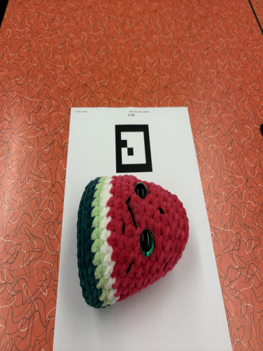
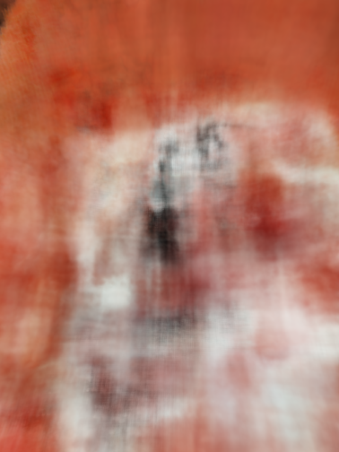
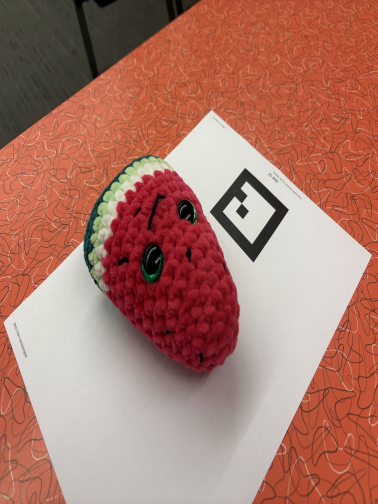
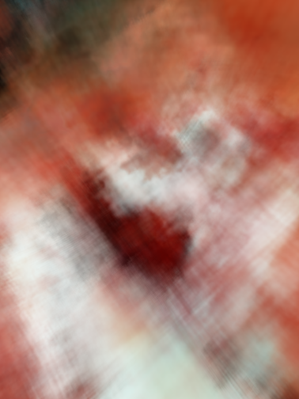
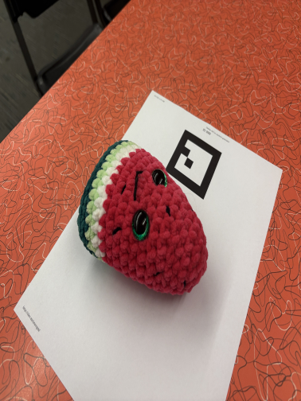
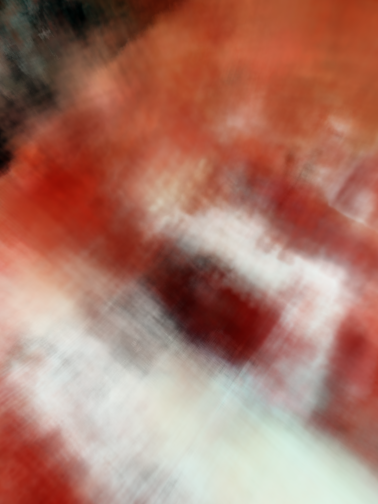
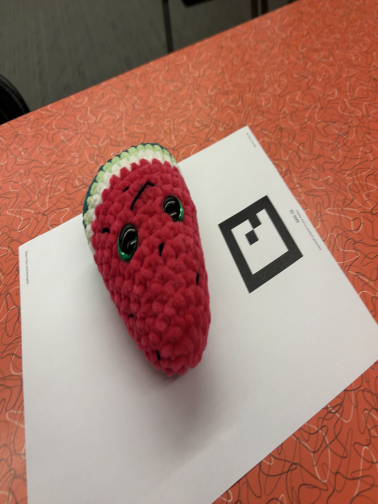
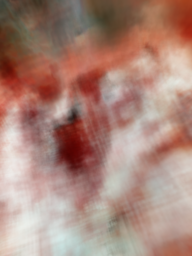
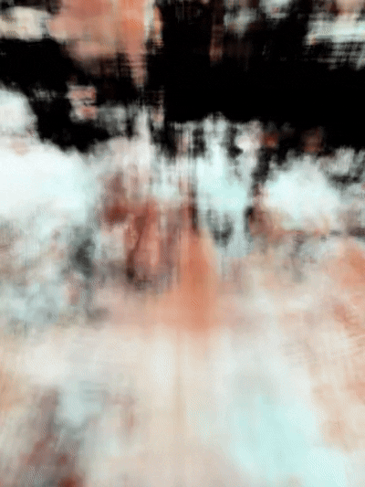

### Neural Radiance Field (NeRFs)

A [NeRF](https://www.matthewtancik.com/nerf) is a way to reconstruct a 3D scene from a set of 2D images. Instead of storing the scene as a mesh or point cloud, a NeRF learns a continuous function that maps **position in 3D space + rotation aligned to origin yields colour + density @ point in 3D space.**

This function is represented by a small neural network. For every camera ray, the model samples points through the scene, predicts the color and density at each point, and then uses volume rendering to combine those predictions into a final pixel color. By optimizing the rendered pixels to match the original training images, the network gradually learns the geometry and appearance of the scene.

The key idea is that once the model has learned this continuous 3D representation, we can render the object or scene from new viewpoints that were never directly seen during training. 

### Camera Poses with ArUco Markers
Before training the NeRF, each image needs a camera pose: where the camera was in 3D space, and which direction it was looking when the photo was taken. Instead of manually calibrating a camera, I used used an ArUco marker as a fixed reference point in the scene.

  

The ArUco marker acts as the world space origin. Since the physical size of the marker is known, we can define its four corners as 3D points on a flat plane. Math doesn't pertain to the functionality of a NeRF, and rather I used OpenCV to the 2D pixel locations of the marker corners using `solvePnP`. This gives the rotation and translation of the marker relative to the camera.

In other words, the ArUco marker lets us recover the camera pose for every image. The marker becomes the shared coordinate system, and every camera is placed relative to that coordinate system.

Once the camera pose is known, the NeRF pipeline can generate rays. For each pixel, we compute a ray that starts at the camera center and travels into the 3D scene: $\mathbf{r}(t) = \mathbf{o} + t\mathbf{d}$ where $o$ is the camera position in world space, $d$ is the ray direction for that pixel, and $t$ controls how far along the ray we sample. Code in `/photo_calbiration` and `src/volume_rendering.py`.

The NeRF then samples many 3D points along each ray. Each sampled point, along with the viewing direction, is passed into the MLP. The network predicts color and density at those locations, and using volume rendering we combine those predictions into the final pixel color.

This is what allows predictions from the MLP to become a 3D reconstruction problem.

### Hierachical Sampling
Rendering a pixel requires estimating an integral along a camera ray, which is done by sampling points along that ray. Because of this, the quality of the rendering depends heavily on where those samples are placed.

Imagine a ray passing through an object. High density regions corresponds to actual surfaces or objects, while empty space has little or no density. Ideally, we want most of our samples to concentrate around the important high density regions instead of wasting computation in empty areas.

A naive approach would be to sample points at fixed intervals along the ray. While simple, this causes two major issues: many samples may fall in empty space and contribute almost nothing to the final rendered color and if the exact same sample locations are reused every training iteration, the network will overfit to those specific points. 

Before the NeRF paper was introduced, NeRF used stratified sampling. The ray interval is divided into N boxes, and one random point is sampled uniformly inside each bin. Since the sampled positions vary every iteration, the network learns a more continuous representation of the scene and doesn't overfit.

But even stratified sampling is not enough. It is very much possible that not enough samples are placed near important surfaces. That's why in the paper, **hierarchical sampling** is introdiced and uses two networks: a coarse network and a fine network.

Samples are generated using stratified sampling and passed through the coarse network, which predicts densities and colors along the ray NeRF computes weights $w_i$ that indicate how much each sample contributes to the final rendered pixel. These weights depend on both the predicted density $σ_i$, and the transmittance $T_i$, which measures how much light reaches that point without being absorbed earlier along the ray. 

Finally, the fine network is trained using the samples from regions with larger weights. This concentrates computation around likely surface locations. Think of it intuitively, a point with low density contributes very little, and a point hidden behind opaque regions also has little effect even if its density is high.

If you want to read more about this, I based my code in `src/volume_rendering.py` off the [Scratchapixel Volume Rendering Documentation](https://www.scratchapixel.com/lessons/3d-basic-rendering/volume-rendering-for-developers/volume-rendering-summary-equations.html).

### Results
The final model was trained for **20,000+ iterations** using **44 calibrated images**, each with a reprojection error below **10 px**. Each training image was downsampled to **1512 × 2016** resolution.

The training pipeline was first run on a single NVIDIA T4 GPU (using Colab), then optimized across **2× NVIDIA T4 GPUs** (using Runpod and F16 mixed-precision) to improve training throughput. The images below are with the single GPU training. The left image is the ground truth, and the right image is the model prediction.

<table>
  <tr>
    <th>Ground Truth</th>
    <th>NeRF Render</th>
  </tr>
  <tr>
    <td></td>
    <td></td>
  </tr>
  <tr>
    <td></td>
    <td></td>
  </tr>
  <tr>
    <td></td>
    <td></td>
  </tr>
  <tr>
    <td></td>
    <td></td>
  </tr>
</table>

**Final 360 render (PSNR of 20):**

 

### Reflections
Data quality matters more than anything. Reprojection errors or incorrect measurements of the Aruco tags result in massive errors that lead to a PSNR that platues around 10. I really recommend running some data filtering step before training the NeRF to rule out bad images, helps a ton!

Even with more training the model plateaus and gets incrementally better! This alludes something is wrong with the model setup itself or the image data.

Next step is to add text editing into the NeRF: https://arxiv.org/pdf/2303.12789.
